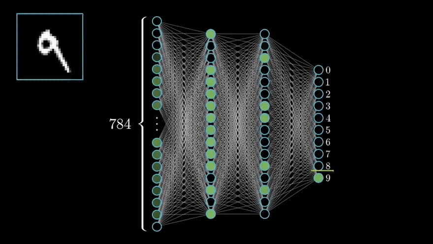

# Neural Network Digit Recognizer

## Introduction
This project is a digit recognizer that uses a neural network to identify digits from images. The neural network is trained on the MNIST dataset, which consists of 60,000 training images and 10,000 test images. The project uses Python programming language.

## How to use
1. Clone the repository.
2. Install the required dependencies.
3. Run the `digit_recognizer.py` file. or  run on [colab](https://colab.research.google.com/github/samadpls/NeuralNet-DigitRecognizer/blob/main/digit_recognizer.ipynb)
4. Simply view it on website https://bit.ly/NeuralNet-DigitRecognizer

## Dependencies
1. NumPy
2. Matplotlib

## Acknowledgement
I followed a YouTube tutorial to make this project as I am learning neural network, and this is considered as the "hello world" of neural networks.

## Future Plans
Currently, this project is written in Python, but my goal is to rewrite it in Scala. Scala is a powerful scalable language and is used for big data analysis. The main reason I love Scala is its functional programming paradigm, which makes code easier to read and maintain.
